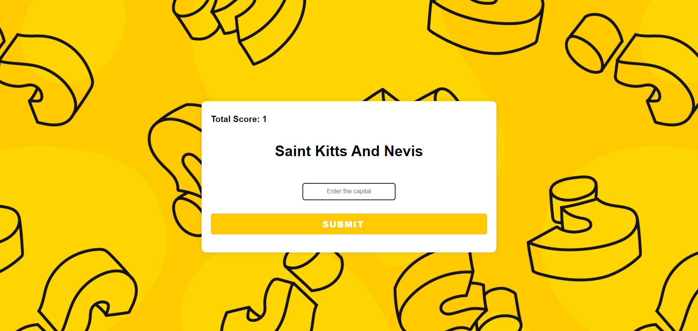

# Capital City Quiz App

This is a web application built with Express.js and PostgreSQL for a Capital City Quiz game. Users can test their knowledge of capital cities by answering quiz questions.



## Installation

1. Clone the repository:
   ```bash
    git clone - https://github.com/KRISHNAKUMARPS2002/World_Capital_Quiz.git

2. Navigate to the project directory:
bash
Copy code
cd capital-city-quiz

3. Install dependencies:
bash
Copy code
npm install

4. Set up PostgreSQL database:
Create a PostgreSQL database named "world".
Update the database connection details in app.js if necessary.
Usage
Start the application:
bash
Copy code
npm start
Open your web browser and navigate to http://localhost:3000 to play the quiz.

## Features
1. Randomly generates quiz questions from a PostgreSQL database.
2. Tracks and displays the user's total score.
3. Provides instant feedback on correct and incorrect answers.

## Technologies Used
* Express.js
* PostgreSQL
* HTML/CSS
* JavaScript
